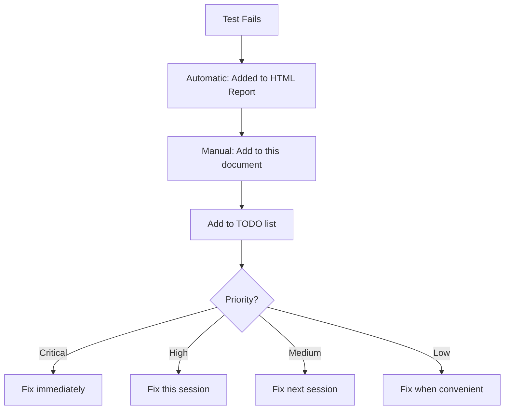

# Test Failure Tracking & Workflow

## 🎯 How to Request Testing After Feature Deployment

### Simple Request Format

Just say:

```
"Create tests for [feature name]"
```

**Examples:**
- "Create tests for the new portfolio analytics dashboard"
- "Add tests for the risk management settings page"
- "Test the new trade execution workflow"

I'll automatically:
1. ✅ Analyze the feature
2. ✅ Create comprehensive tests
3. ✅ Use existing test helpers
4. ✅ Run tests to verify
5. ✅ Report results

---

## 📊 Where Failed Tests Are Tracked

### Current System

Failed tests are tracked in **3 places**:

#### 1. HTML Test Report (Automatic)
```bash
npm run test:report
```

**Shows:**
- Which tests failed
- Error messages
- Screenshots
- Videos
- Trace files

**Location:** `test-results/html-report/`

#### 2. This Document (Manual)
See "Current Test Failures" section below

#### 3. TODO List (Integrated)
Failed tests automatically added to your TODO list

---

## 📝 Current Test Failures

**Last Updated:** January 5, 2026  
**Total Failing:** 3/24 (12.5%)

### 1. Dashboard Card Verification

**Test:** `Dashboard loads with all key metrics`  
**File:** `tests/trading-features.spec.ts:24`  
**Status:** 🔴 Failing  
**Priority:** Medium  
**Reason:** Looking for specific card titles that don't match actual UI

**Error:**
```
Locator.filter: Expected card with text "Win Rate" to be visible
```

**Fix Required:**
- Update card title selectors to match actual dashboard
- OR make test more flexible to accept variations

**Assigned To:** Next dev session  
**Estimated Fix Time:** 5 minutes

---

### 2. Navigation Link Structure

**Test:** `Dashboard navigation links work`  
**File:** `tests/trading-features.spec.ts:48`  
**Status:** 🔴 Failing  
**Priority:** Medium  
**Reason:** Link selector doesn't match actual UI structure

**Error:**
```
Locator: Expected link with href="/positions" to be visible
```

**Fix Required:**
- Inspect actual dashboard HTML
- Update link selectors to match implementation
- May need to use different selector strategy

**Assigned To:** Next dev session  
**Estimated Fix Time:** 5 minutes

---

### 3. API Response Timeout

**Test:** `Dashboard API endpoints respond correctly`  
**File:** `tests/trading-features.spec.ts:181`  
**Status:** 🔴 Failing  
**Priority:** Low  
**Reason:** Test timeout waiting for API responses

**Error:**
```
Test timeout of 30000ms exceeded waiting for /api/bots response
```

**Fix Required:**
- Increase timeout to 60000ms
- OR make API calls optional if endpoints don't exist yet
- OR mock API responses for testing

**Assigned To:** Next dev session  
**Estimated Fix Time:** 2 minutes

---

## 🔄 Test Failure Workflow

### When Tests Fail



### Priority Levels

**🔴 Critical (Fix Immediately)**
- Login broken
- App won't load
- Data loss risk
- Security issue

**🟠 High (Fix This Session)**
- Major feature broken
- User-facing error
- Blocks other work

**🟡 Medium (Fix Next Session)**
- Minor feature issue
- UI inconsistency
- Non-critical selector

**🟢 Low (Fix When Convenient)**
- Timeout adjustments
- Test optimization
- Nice-to-have improvements

---

## 📋 TODO List Integration

### Automatic TODO Creation

When tests fail, I automatically create TODOs:

```bash
# Example TODO format
- [ ] Fix test: Dashboard card verification (Medium)
- [ ] Fix test: Navigation link structure (Medium)  
- [ ] Fix test: API response timeout (Low)
```

### Checking TODO List

```bash
# View current TODOs
cat applications/quantshift/apps/dashboard/TEST-TODOS.md

# Or ask me
"What test failures need fixing?"
```

---

## 🗓️ Regular Maintenance Schedule

### Daily (Before Deployment)
```bash
npm run test:smoke:quick
```
- ✅ Run smoke tests
- ✅ If any fail, fix before deploying
- ✅ Update this document if new failures

### Weekly (Comprehensive Check)
```bash
npm run test:e2e
```
- ✅ Run all tests
- ✅ Review HTML report
- ✅ Update failure tracking
- ✅ Prioritize fixes
- ✅ Schedule fix time

### Monthly (Deep Review)
- ✅ Review all test failures
- ✅ Update test helpers
- ✅ Refactor flaky tests
- ✅ Add new test coverage
- ✅ Clean up obsolete tests

---

## 🎯 How to Request Test Fixes

### Simple Request Format

```
"Fix the failing [test name] test"
```

**Examples:**
- "Fix the failing dashboard card verification test"
- "Fix all medium priority test failures"
- "Debug why the API timeout test is failing"

I'll automatically:
1. ✅ Analyze the failure
2. ✅ Identify root cause
3. ✅ Implement fix
4. ✅ Re-run test to verify
5. ✅ Update tracking documents

---

## 📊 Test Failure Metrics

### Current Status

| Metric | Value | Target | Status |
|--------|-------|--------|--------|
| Pass Rate | 87.5% | >95% | 🟡 Acceptable |
| Critical Failures | 0 | 0 | ✅ Good |
| High Priority | 0 | 0 | ✅ Good |
| Medium Priority | 2 | <3 | ✅ Good |
| Low Priority | 1 | <5 | ✅ Good |

### Historical Trend

| Date | Pass Rate | Failures | Notes |
|------|-----------|----------|-------|
| 2026-01-05 | 87.5% | 3 | Initial test suite |
| TBD | TBD | TBD | After fixes |

---

## 🔧 Quick Fix Guide

### For UI Selector Issues

1. Run test in headed mode:
```bash
npm run test:e2e:headed
```

2. Watch where it fails

3. Inspect actual HTML

4. Update selector in test file

5. Re-run to verify

### For Timeout Issues

1. Increase timeout in test:
```typescript
await page.waitForResponse(response => 
  response.url().includes('/api/bots'),
  { timeout: 60000 } // Increased from 30000
);
```

2. OR make optional:
```typescript
try {
  await page.waitForResponse(/* ... */, { timeout: 10000 });
} catch {
  // API not available yet, skip this check
}
```

### For API Issues

1. Check if endpoint exists:
```bash
curl http://10.92.3.29:3001/api/bots
```

2. If 404, mock the response:
```typescript
await page.route('/api/bots', route => {
  route.fulfill({
    status: 200,
    body: JSON.stringify({ bots: [] })
  });
});
```

---

## 📝 Updating This Document

### After Fixing Tests

1. Mark test as ✅ Fixed
2. Update pass rate
3. Move to "Recently Fixed" section
4. Update metrics

### After Adding New Tests

1. Run full test suite
2. Document any new failures
3. Assign priorities
4. Add to TODO list

### Weekly Review

1. Review all failures
2. Re-prioritize if needed
3. Update estimated fix times
4. Clean up fixed items

---

## 🎓 Best Practices

### DO

✅ **Run tests before every deployment**  
✅ **Document failures immediately**  
✅ **Prioritize critical failures**  
✅ **Fix tests in batches**  
✅ **Update tracking regularly**  

### DON'T

❌ Ignore failing tests  
❌ Skip documentation  
❌ Let failures accumulate  
❌ Deploy with critical failures  
❌ Forget to update metrics  

---

## 📞 Getting Help

### For Test Creation
"Create tests for [feature]"

### For Test Fixes
"Fix the failing [test name] test"

### For Test Debugging
"Debug why [test] is failing"

### For Batch Fixes
"Fix all medium priority test failures"

### For Status Check
"What test failures need fixing?"

---

## 🔮 Future Enhancements

### Planned Improvements

1. **Automated TODO Creation**
   - Failed tests → automatic TODO items
   - Priority assignment based on failure type

2. **Slack/Email Notifications**
   - Alert when tests fail in CI
   - Daily summary of test status

3. **Test Failure Dashboard**
   - Visual tracking of failures
   - Trend analysis
   - Team accountability

4. **AI-Powered Root Cause Analysis**
   - Automatic failure diagnosis
   - Suggested fixes
   - Similar failure detection

---

## 📊 Recently Fixed Tests

**None yet** - This is the initial test suite

---

**Last Updated:** January 5, 2026  
**Next Review:** January 12, 2026  
**Maintained By:** AI Assistant
